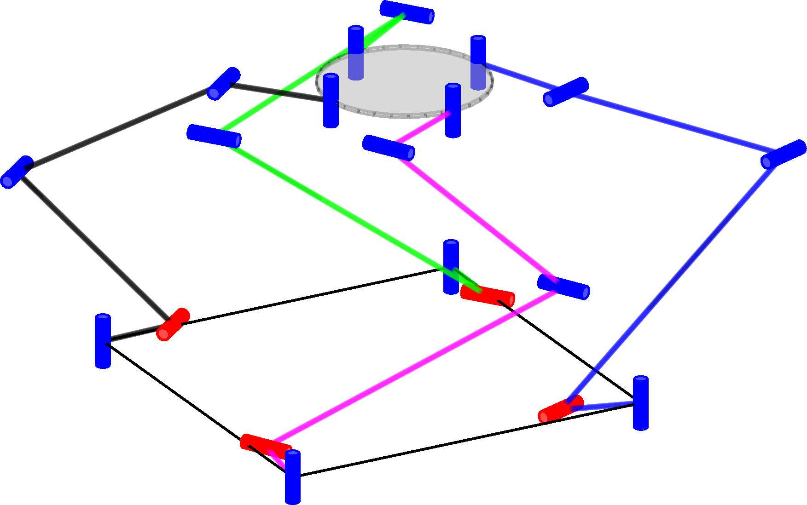
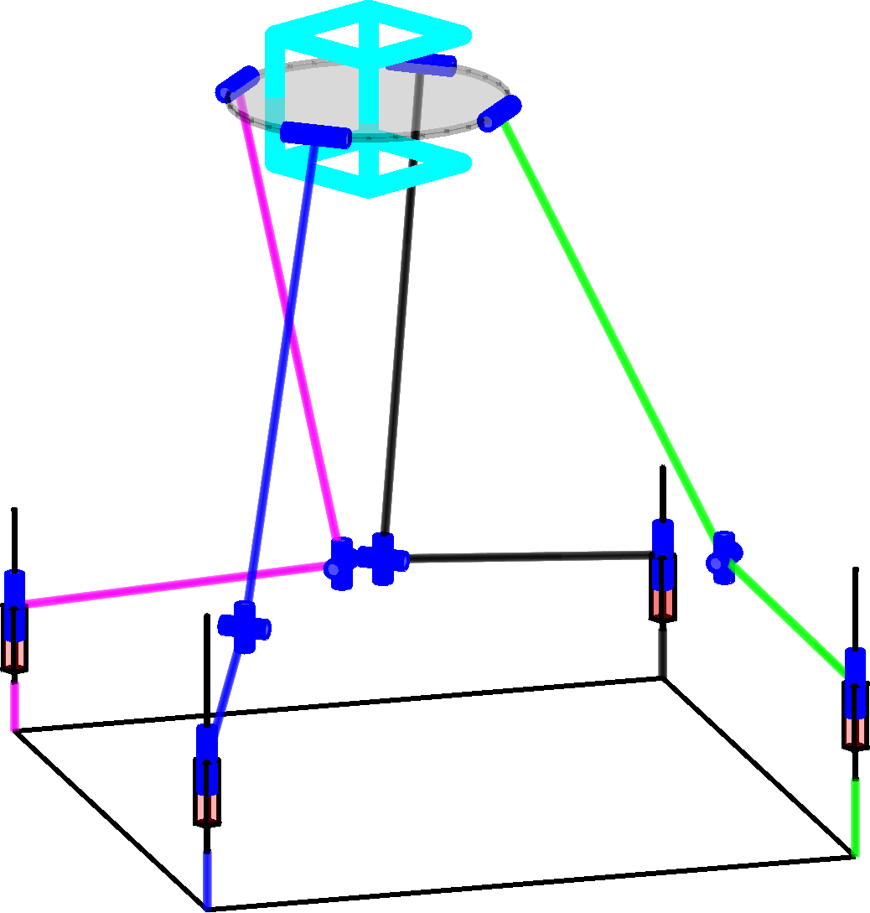
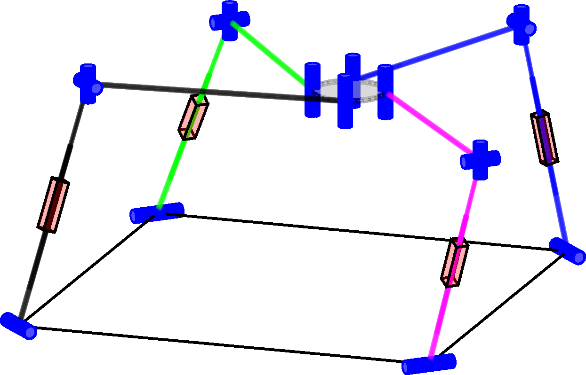

# Inverse Kinematics for Task Redundancy of Symmetric 3T1R Parallel Manipulators using Tait-Bryan-Angle Kinematic Constraints


Author: Moritz Schappler

This code is supplemental material to the following submission to the [ARK Conference 2022](https://ark2022.com/):

```bib
@InProceedings{Schappler2022,
  author       = {Schappler, Moritz},
  booktitle    = {International Symposium on Advances in Robot Kinematics},
  title        = {Inverse Kinematics for Task Redundancy of Symmetric 3T1R Parallel Manipulators using Tait-Bryan-Angle Kinematic Constraints},
  organization = {Springer},
  year         = {2022},
}
```
<p align="middle">
   
  
  
</p>
Fig. 3 of the paper: example for 3T1R parallel robots that were synthesized with the proposed toolbox

## Contents and Useage

This repository contains Matlab scripts and Latex code to reproduce results and statements of the paper. Beforehand, the steps from the [prerequesites section](#prerequisites) have to be performed.

### Reproduce Results

Each section of the paper can be reproduced by a Matlab script.

* Sec. 2 and 3 (parallel robot model with and without overconstraint, IK and Jacobian matrices)
  * `proof/ParRob_3T1R_taskred_mdl_proof.m`
* Sec. 4 (exemplary dimensional synthesis)
  * See next section of this document
* The figures are created using InkScape with Latex export option

## Dimensional Synthesis
  
1. To reproduce the results, first the dimensional synthesis has to be performed by running the Matlab script `dimsynth/dimsynth_3T1R_example.m`.
    * If existing results shall be evaluated, their location has to be set with `ark2022_3T1R_dimsynth_data_dir.m`. Then this step can be omitted
    * The results that were used in the paper are stored in `data/synthesis` and are used by default
2. The results have to be post-processed by the scripts from `dimsynth`:
    * `eval_figures_pareto.m`: Assemble all Pareto fronts for the individual robots
    * `robot_names.m`: The names of the robots have to be generated (e.g. for the figure captions); only once.
    * `eval_figures_pareto_groups.m`: Group the robots to a smaller set. This is used in the presentation.
    * `select_eval_robot_examples.m`: Select the specific robot structures from the Pareto front for the detailed view from the previous step. Enable the flag `recreate_redundancy_map` to create the redundancy maps of **Fig. 3,b of the paper** for each robot group.
3. The robot figures and detail information is reproduced with the Matlab scripts from `dimsynth`:
    * `robot_images.m`: Creates one image file for each robot. These are taken in `paper/figures/robots.svg` to create **Fig. 3,a of the paper**.
    * Two redundancy maps are assembled in `paper/figures/perfmap_1x2.svgz` for **Fig. 3,b of the paper**.

The steps 2 to 3 can be performed after each iteration of the dimensional synthesis by using `run_evaluation.m` in the paper repo's root directory.

## Prerequisites <a name="prerequisites">

For the Matlab scripts to work, the following steps have to be performed:

1. Install Matlab (tested with R2021b)
2. Set up the Matlab mex compiler, if not already done
3. Set up the path to the results for this paper by copying `ark2022_3T1R_dimsynth_data_dir.m.template` without the template suffix to the same location and by changing the content of the file to point to the stored results of the synthesis.
4. Download Matlab dependencies:
    * [Toolbox for geometry functions](https://github.com/SchapplM/robotics-dep-geometry) (tested with rev. c4af53d; 2021-10-26)
    * [Toolbox for trajectory functions](https://github.com/SchapplM/robotics-dep-traj) (tested with rev. b13e68d; 2021-08-16)
    * [Collection of external dependencies](https://github.com/SchapplM/robotics-dep-ext) (tested with rev. 22ebc7b; 2022-01-24)
    * [Toolbox for various Matlab functions](https://github.com/SchapplM/matlab_toolbox) (tested with rev. da5759e; 2022-01-04)
    * [Robotics toolbox](https://github.com/SchapplM/robotics-toolbox) (tested with rev. b7650ad; 2022-02-01)
    * [Serial robot model database](https://github.com/SchapplM/robsynth-serroblib) (tested with rev. 2256437f8; 2022-02-01)
    * [Parallel robot model database](https://github.com/SchapplM/robsynth-parroblib) (tested with rev. 44b328d; 2022-02-01)
    * [Toolbox for symbolic robot model generation](https://github.com/SchapplM/robsynth-modelgen) (tested with rev. fd37713; 2022-01-20)
    * [Toolbox for transferring jobs to a computing cluster](https://github.com/SchapplM/matlab_pbs_transfer) (tested with rev. 2a99eae; 2022-01-30)
    * [Dimensional synthesis toolbox](https://github.com/SchapplM/robsynth-structdimsynth) (tested with rev. 2c8085a; 2022-02-01)
    * Update the repositories to the given versions. If the master branch is on an older version, change of branch is required. You should first try the more recent version before downgrading to the given versions. It should still work.
    * Short command to download all repositories (run in Git Bash in Windows or in Linux terminal):
      ```Bash
      git clone git@github.com:SchapplM/robotics-dep-geometry.git -b dev
      git clone git@github.com:SchapplM/robotics-dep-traj.git -b dev
      git clone git@github.com:SchapplM/robotics-dep-ext.git -b dev
      git clone git@github.com:SchapplM/matlab_toolbox.git -b dev
      git clone git@github.com:SchapplM/robotics-toolbox.git -b dev
      git clone git@github.com:SchapplM/robsynth-serroblib.git -b dev
      git clone git@github.com:SchapplM/robsynth-parroblib.git -b dev
      git clone git@github.com:SchapplM/robsynth-modelgen.git -b dev
      git clone git@github.com:SchapplM/matlab_pbs_transfer.git -b master
      git clone git@github.com:SchapplM/robsynth-structdimsynth.git -b dev
      ```
5. Set up the toolboxes by modifying the following files according to the instructions in the respective README files
    * robsynth-serroblib/maplerepo_path.m.template (has to link to robsynth-modelgen)
    * robsynth-structdimsynth/computingcluster_repo_path.m.template (has to link to matlab_pbs_transfer, if a cluster is used for computation)
6. Run the path initialization scripts (`..._path_init.m`) of all downloaded software repos in Matlab. Put the run commands in the startup.m file of Matlab if used frequently.

